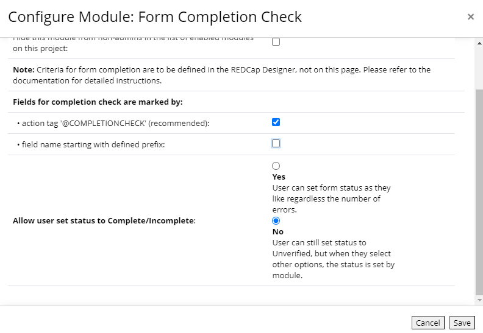
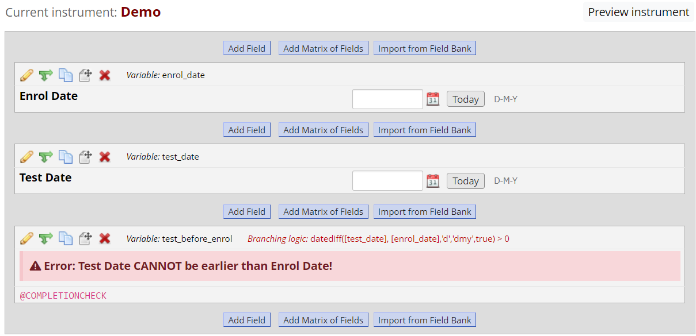
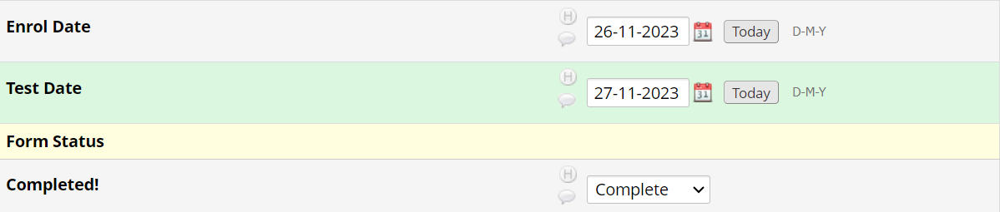
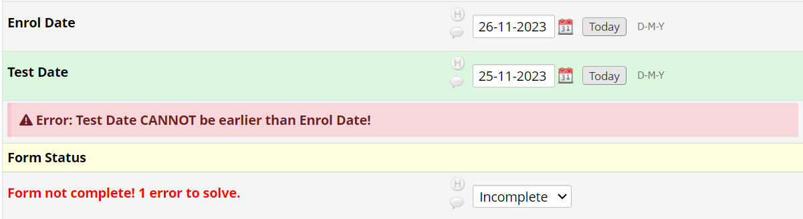
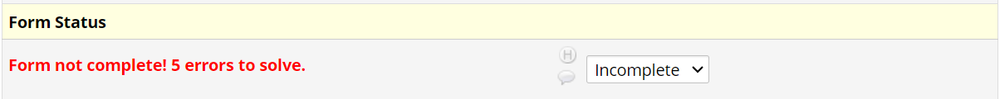

### REDCap External Module
********************************************************************************
# Form Completion Check
********************************************************************************

## Description
Automatically set the form completion status in REDCap Data Entry Forms (not applicable to Surveys). You can define complex criteria for form completion, provided that each criterion can be expressed in branching logic. The completion status will be automatically set to either Complete or Incomplete based on your specified criteria. Data entry users can acknowledge that their data requires further checking by manually setting the status to *Unverified*. In this case, the status will not be changed automatically, until the user sets it to Complete or Incomplete.

## Features
- **Automated Completion Status**: Automatically updates the completion status of forms based on user-defined criteria.
- **User-Defined Completion Criteria**: Users can customize descriptive text fields to carry their desired criteria via branching logic.
- **Customizable Field Identification**: Users can define criteria fields using an action tag *@COMPLETIONCHECK* (recommended), and/or a specific prefix for field names.

## Installation from GitHub
1. Clone or download this repository.
2. Place the module folder in REDCap's `modules` directory.
3. Enable the module in the REDCap Control Centre, then in the project using this module.

## How to Use
1. Enable the 'Form Completion Check' module for your project.
2. Configure the module settings in your project.
   
   Choose how this module can identify your fields carrying completion criteria, either by using the action tag *@COMPLETIONCHECK* (recommended) or a customized prefix for field names.
   

    
   

3. Define your completion criteria fields in the Designer.
   
   Your criteria fields should be of *Descriptive Text* type. Use them to display warning messages to let users know what went wrong. Set branching logic for these fields so they will only display when the input data does not meet the expectations.
   

    
    

4. The module will detect the display status of the criteria fields; each displayed criteria field counts as an error. Unless the user has indicated the form is *Unverified*, the module will set the form as *Complete* if no errors are found, otherwise, it will set the form as *Incomplete* and display the number of errors detected in red. 

    Complete:
    

        
    

    Incomplete:
    
        One error
    

        
    

        More errors
    

        
    

## Compatibility
This module requires framework 12.0. 

## Support
For any issues or questions, please open an issue on this GitHub repository: https://github.com/willasong/form-completion-check-module.

## Contributing
Contributions to improve 'Form Completion Check' are welcome. Please fork this repository and submit a pull request with your enhancements.

## License
This project is licensed under the MIT License - see the LICENSE file for details.
